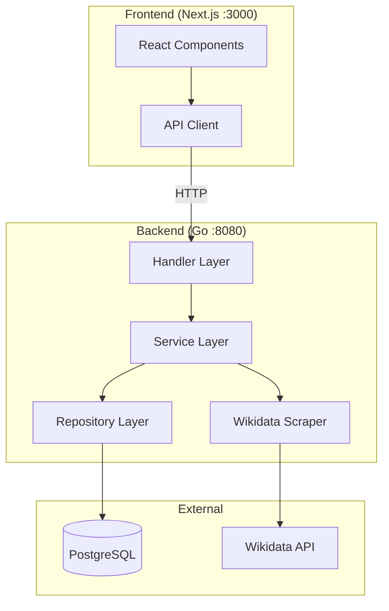
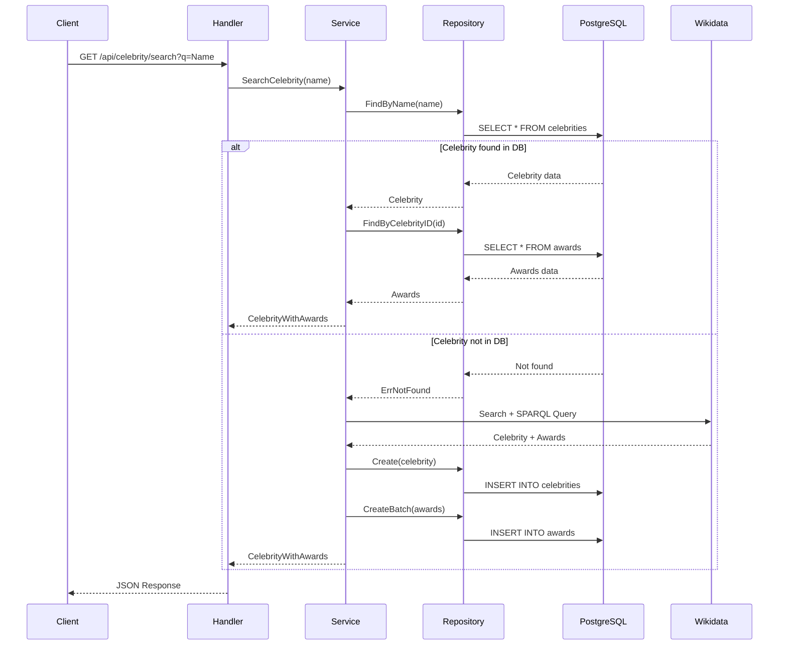
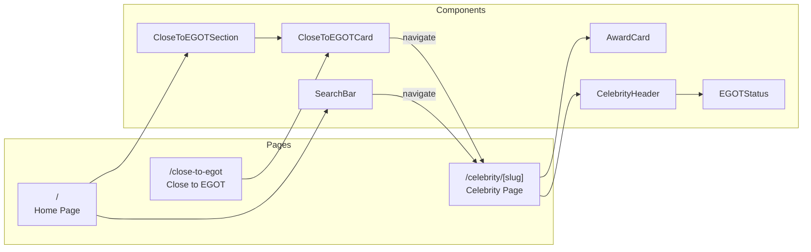

# EGOT Tracker

This file provides guidance to Claude Code when working with this repository.

## Project Overview

EGOT-tracker is a web application that tracks celebrity progress toward achieving EGOT status (Emmy, Grammy, Oscar, Tony awards). The application uses a "cache-aside" strategy: check local database first, fetch from Wikidata if missing, save to database, and return results.

## Current Status

- Phase 1 (Backend API) - Complete
- Phase 2 (Wikidata scraper) - Complete
- Phase 3 (Frontend) - Complete
- Phase 4 (Close to EGOT feature) - Complete

## Tech Stack

- **Backend**: Go 1.22+ with standard library net/http
- **Frontend**: Next.js 14 (App Router) with React
- **Styling**: Tailwind CSS with custom "Old Hollywood" theme
- **Database**: PostgreSQL (local via Homebrew)
- **Data Source**: Wikidata SPARQL API (no API key required)

## Quickstart

```bash
# 1. Install and start PostgreSQL (macOS)
brew install postgresql@16
brew services start postgresql@16

# 2. Create database and load schema
/usr/local/opt/postgresql@16/bin/createdb egot_tracker
/usr/local/opt/postgresql@16/bin/psql -d egot_tracker -f setup.sql

# 3. Configure environment
cp .env.example .env  # Or create .env with:
# DATABASE_URL=postgresql://localhost:5432/egot_tracker?sslmode=disable
# PORT=8080

# 4. Seed the database with notable celebrities (optional but recommended)
go run ./cmd/seed

# 5. Fetch photos from Wikidata for seeded celebrities
go run ./cmd/fetch-photos

# 6. Start the backend (Terminal 1)
go run ./cmd/api
# Should see: "Connected to database" and "Server starting on port 8080"

# 7. Start the frontend (Terminal 2)
cd frontend && npm install && npm run dev
# Visit http://localhost:3000
```

## Utility Scripts

```bash
# Seed database with ~20 notable EGOT contenders
go run ./cmd/seed

# Fetch photos from Wikidata for celebrities without photos
go run ./cmd/fetch-photos

# Run the API server
go run ./cmd/api
```

## Architecture

### System Overview



### Cache-Aside Pattern



### Frontend Flow



## Project Structure

```
egot-tracker/
├── cmd/
│   ├── api/main.go              # API server entry point
│   ├── seed/main.go             # Database seeding script
│   └── fetch-photos/main.go     # Fetch photos from Wikidata
├── internal/
│   ├── config/config.go         # Environment configuration
│   ├── database/db.go           # pgxpool connection
│   ├── models/
│   │   ├── celebrity.go         # Celebrity structs
│   │   └── award.go             # Award struct and types
│   ├── repository/
│   │   ├── celebrity_repository.go  # DB queries
│   │   └── award_repository.go      # Award DB queries
│   ├── scraper/
│   │   ├── wikidata.go          # Wikidata SPARQL client
│   │   └── models.go            # API response types
│   ├── service/
│   │   └── celebrity_service.go # Business logic
│   └── handler/
│       └── celebrity_handler.go # HTTP handlers
├── pkg/response/response.go     # JSON helpers
├── setup.sql                    # Database schema
├── .env                         # Environment variables (git-ignored)
├── .gitignore
├── go.mod
│
└── frontend/
    ├── app/
    │   ├── layout.tsx           # Root layout with fonts
    │   ├── page.tsx             # Home page
    │   ├── globals.css          # Tailwind + Hollywood theme
    │   ├── close-to-egot/
    │   │   └── page.tsx         # Close to EGOT page
    │   └── celebrity/[slug]/
    │       └── page.tsx         # Celebrity detail page
    ├── components/
    │   ├── SearchBar.tsx        # Search with autocomplete
    │   ├── CloseToEGOTCard.tsx  # Celebrity progress card
    │   ├── CloseToEGOTSection.tsx # Featured section
    │   ├── CelebrityHeader.tsx  # Name, photo, EGOT status
    │   ├── EGOTStatus.tsx       # Four award circles
    │   └── AwardCard.tsx        # Individual award display
    ├── lib/
    │   └── api.ts               # API client functions
    ├── .gitignore
    ├── package.json
    ├── tailwind.config.ts
    └── next.config.ts
```

## API Endpoints

### GET /api/celebrity/search?q=NAME

Search for a celebrity. Fetches from Wikidata if not in database.

```bash
curl "http://localhost:8080/api/celebrity/search?q=Viola%20Davis"
```

### GET /api/celebrity/autocomplete?q=QUERY

Search cached celebrities for autocomplete suggestions.

```bash
curl "http://localhost:8080/api/celebrity/autocomplete?q=Vio"
```

### GET /api/celebrity/close-to-egot

Get celebrities with 3 of 4 EGOT awards.

```bash
curl "http://localhost:8080/api/celebrity/close-to-egot"
curl "http://localhost:8080/api/celebrity/close-to-egot?limit=10"
```

### GET /health

Health check endpoint.

```bash
curl http://localhost:8080/health
```

## Database Schema

### celebrities table
| Column | Type | Description |
|--------|------|-------------|
| id | uuid | Primary key |
| name | text | Celebrity name (unique) |
| slug | text | URL-friendly name |
| photo_url | text | Profile image URL |
| last_updated | timestamp | Cache timestamp |

### awards table
| Column | Type | Description |
|--------|------|-------------|
| id | uuid | Primary key |
| celebrity_id | uuid | Foreign key to celebrities |
| type | enum | 'Emmy', 'Grammy', 'Oscar', 'Tony' |
| year | int | Year won |
| work | text | Title of winning work |
| category | text | Specific award category |
| is_winner | boolean | Won vs nominated |
| ceremony_date | date | Date of ceremony (for upcoming) |
| is_upcoming | boolean | Future nomination flag |

## Common Commands

```bash
# Backend
go run ./cmd/api              # Run server
go run ./cmd/seed             # Seed database
go run ./cmd/fetch-photos     # Fetch celebrity photos
go build -o egot-tracker ./cmd/api
go fmt ./...
go mod tidy

# Frontend
cd frontend
npm install                   # Install dependencies
npm run dev                   # Development server
npm run build                 # Production build
npm run lint

# Database
/usr/local/opt/postgresql@16/bin/psql -d egot_tracker
```

## Frontend Design

The frontend uses an "Old Hollywood" aesthetic:

- **Colors**: Deep blacks (#0a0a0a), rich golds (#d4af37), cream whites (#f5f5dc)
- **Typography**: Playfair Display (headings), Inter (body)
- **Elements**: Art deco patterns, gold star motifs, elegant borders
- **Effects**: Gold shimmer animation, subtle glows

## Wikidata Integration

The scraper uses two Wikidata APIs:

1. **Search API**: Find person's Wikidata ID by name (with EGOT disambiguation)
2. **SPARQL Endpoint**: Query awards using property P166 (award received)

Awards are filtered by name to identify EGOT types. Data quality depends on Wikidata completeness.

## Git Setup

```bash
git init
git add .
git commit -m "Initial commit: EGOT Tracker"
```

**Protected by .gitignore:**
- `.env` (database credentials)
- `frontend/.next/` (build artifacts)
- `frontend/node_modules/`
- Go binaries
